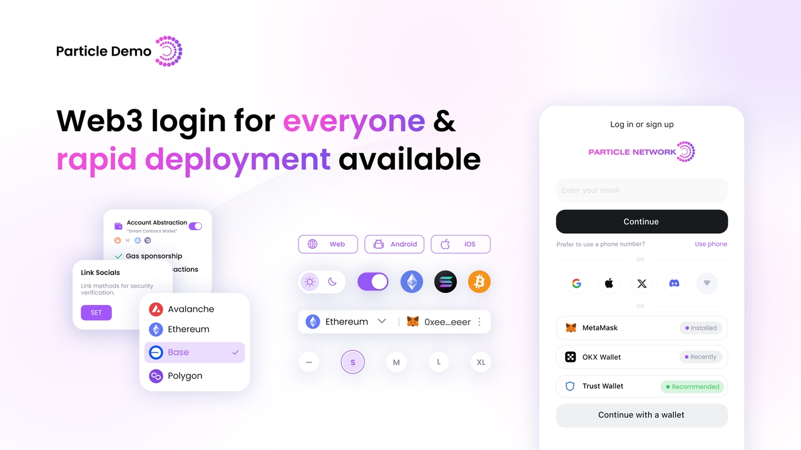

<a href="https://particle.network">
  
</a>

# Particle Connectkit

[Particle Connect](https://developers.particle.network/api-reference/connect/desktop/web) enables a unified modal to onboard users with social logins (through Particle Auth) and standard Web3 wallets, creating an equally accessible experience for Web3 natives and traditional consumers. Particle Connect is an all-in-one SDK capable of handling end-to-end onboarding and wallet connection.

## Overview

Particle Connectkit is a [React](https://react.dev/) library that easily adds wallet and social login support to your dApp.  

Particle Connectkit provides the following key features:

- **Multi-Chain Support**: Compatible with all EVM-compatible chains supported by Particle Network and Solana.
- **Multiple Login Methods**: Supports login via email, phone, social accounts, and traditional wallets.
- **Customizability**: Easily adapt the interface and functionality to suit your needs.
- **Account Abstraction**: Implements [EIP-4337](https://eips.ethereum.org/EIPS/eip-4337) for account abstraction.
- **Embedded Wallet**: Includes an embedded wallet for easy user onboarding.
- **Wallet Management**: Offers out-of-the-box wallet management built on `Viem`.

## Getting Started

To scaffold a new project with Particle Connectkit, use the following command:

```bash
npm init @particle-network/connectkit@latest
# or
pnpm create @particle-network/connectkit@latest
# or
yarn create @particle-network/connectkit
```

This command will guide you through the setup and generate a starter project with Particle Connect preconfigured in `connectkit.tsx`, including a ready-to-use **Connect** button.

## Examples

You can find example projects in the [examples](./examples/) directory of this repository:

- `next-connectkit-app`
- `react-connectkit-app`

## Learn More

- 🎉 **[Live Demo](https://demo.particle.netwok)**: Explore a live demo of Particle Connectkit’s features and customization options.
- 👉 **[Documentation](https://developers.particle.network/api-reference/connect/desktop/web)**: Learn more about the features and API of `@particle-network/connectkit`.
